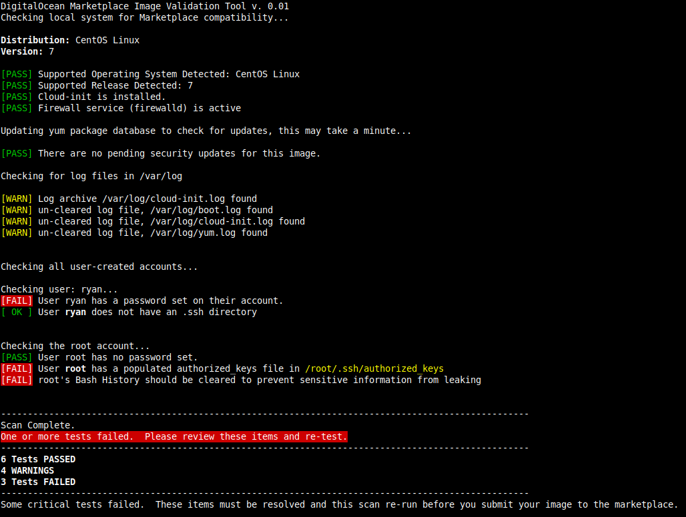

# DigitalOcean Marketplace Partner Tools

Image validation, automation, and other tools for [DigitalOcean Marketplace](https://marketplace.digitalocean.com/) partners and [custom image](https://www.digitalocean.com/docs/images/custom-images/) users.

In this repository, you'll find:

* **Image validation Bash scripts** in `marketplace_validation`

* **Documentation on building images** in `marketplace_docs`

## Getting Started

### Building the Image

To get started with custom images, [build an image manually](marketplace_docs/build-an-image.md) and make sure your configuration works. For Marketplace partners, [repeatable image build processing](marketplace_docs/build-an-image-fabric.md) with [Fabric](http://www.fabfile.org/) is a useful way to ensure replicable and configurable builds.

### Cleaning the Image

You can ensure that your build Droplet gives you a clean image by running [`cleanup.sh`](marketplace_validation/cleanup.sh) after setup. This Ubuntu-based script does several things:

* Deletes bash history so commands you ran during the build process are not stored in the image.
* Cleans up the package manager's database.
* Truncates or removes unneeded log files.
* Removes the cloud-init instance information. This ensures that the image will look to the cloud-init service on first boot for things like networking and also that it will run your first-boot scripts.
* Removes SSH keys from the root user. If your build Droplet has other user accounts, you should remove SSH keys from them as well.

### Validating the Image

Next, validate your image by running [`img_check.sh`](marketplace_validation/img_check.sh) to make sure it's is compatible with Marketplace. This script checks images against the following criteria:

- Uses a [supported distro and release](#supported-distributions)
- All security updates are installed
- Packages are updated
- A firewall is installed and configured
- Uses a valid version of cloud-init
- Doesn't have SSH keys, preset passwords, populated log files/archives, or `bash_history`

`img_check.sh` is designed to be minimally invasive and avoid changes to disk, with the exception that it will update APT and yum package databases to look for uninstalled security updates.

You can use `img_check.sh` from within an image build system before you [create a snapshot](https://www.digitalocean.com/docs/images/snapshots/how-to/snapshot-droplets/) or before you export a disk image from Virtualbox, VMWare, or a physical machine.

## Supported Distributions 

Marketplace currently supports the following distributions:

* Debian 9.x (Stretch)
* Ubuntu 18.04 (LTS)
* Ubuntu 16.04 (LTS)
* CentOS 7.x
* CentOS 6.x 
